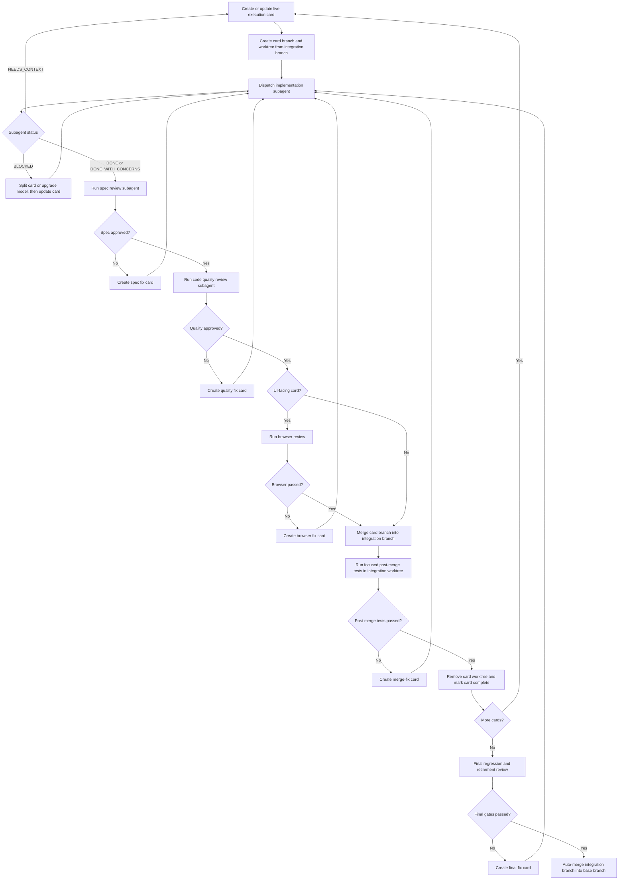

# Retire Legacy Playground Implementation Plan

> **For agentic workers:** REQUIRED SUB-SKILLS: Use superpowers:using-git-worktrees before implementation, then use superpowers:subagent-driven-development to implement this plan task-by-task. Steps use checkbox (`- [ ]`) syntax for tracking.

**Goal:** Move every unique legacy playground capability into Demo Studio so `examples/playground/src/routes/legacy-playground.ts` can be retired without losing decorator or overlay coverage.

**Architecture:** Keep Demo Studio as the only product-quality sandbox and add two advanced demos: one for full line decorator authoring and one for overlay pointer-mode behavior. Extract legacy-only behavior into focused Svelte inspectors and small TypeScript helpers instead of copying the large imperative `innerHTML` route.

**Tech Stack:** Svelte 5, TypeScript, MapLibre GL, GeoForge public APIs, Vitest, Playwright smoke checks through the playground dev server.

---

## Source Feature Inventory

Legacy route: `examples/playground/src/routes/legacy-playground.ts`

Legacy-only capabilities that must be preserved before retirement:

- Decorator route with seeded sample line and drawn GeoForge lines.
- Single-feature line selection/editing workflow.
- Selected line style editor for color, width, opacity, and delete.
- Scenario presets: mixed animated, arrowheads, SVG symbols, text labels.
- Decorator layer order: default, below line, above line.
- Default line style controls.
- Decorator authoring for `symbol`, `text`, and `arrowhead`.
- Placement controls: frequency, segment, anchor, offset percent, line offset px, start offset, end offset.
- Rotation controls: line, fixed, viewport, angle.
- Animation controls for symbol/text properties: rotate, opacity, size, fontSize, duration, delay, iteration count, direction, easing.
- SVG symbol preset selection: chevron, diamond, dot, custom.
- Custom SVG markup editor, CSS editor, live preview, and drag/drop SVG load.
- Decorator list with per-item remove and clear all.
- Feature decorator JSON preview.
- Overlay demo with iframe content.
- Overlay controls for `interactable`, `pointerMode` (`selected`, `always`, `none`), map pitch toggle, and reset.

Existing Demo Studio capabilities to reuse:

- `examples/playground/src/demo-studio/registry/demoRegistry.ts`
- `examples/playground/src/demo-studio/demos/line-decorators/lineDecoratorDemos.ts`
- `examples/playground/src/demo-studio/demos/line-decorators/LineDecoratorsInspector.svelte`
- `examples/playground/src/demo-studio/demos/overlays/overlayDemos.ts`
- `examples/playground/src/demo-studio/demos/overlays/OverlayInspector.svelte`
- `examples/playground/src/demo-studio/ui/components/*`
- `examples/playground/src/demo-studio/demos/shared/symbolImages.ts`

---

## Target File Structure

Create:

- `examples/playground/src/demo-studio/demos/line-decorators/advancedDecoratorAuthoring.ts`
  - Pure state helpers, preset builders, SVG helpers, and validation copied conceptually from legacy.
- `examples/playground/src/demo-studio/demos/line-decorators/AdvancedDecoratorInspector.svelte`
  - Full Svelte UI for legacy decorator authoring controls.
- `examples/playground/src/demo-studio/demos/line-decorators/AdvancedDecoratorJsonPanel.svelte`
  - Focused JSON preview and remove/clear controls.
- `examples/playground/src/demo-studio/demos/overlays/OverlayPointerInspector.svelte`
  - Full Svelte UI for interactable/pointer mode/pitch/reset controls.
- `tests/playground/advancedDecoratorAuthoring.test.ts`
  - Unit tests for presets, SVG validation, decorator construction, and state transitions.
- `tests/playground/legacyRetirement.test.ts`
  - Guard that no production route still depends on `legacy-playground.ts` after retirement.

Modify:

- `examples/playground/src/demo-studio/demos/line-decorators/lineDecoratorDemos.ts`
  - Add `line-decorators-advanced-authoring` demo.
- `examples/playground/src/demo-studio/demos/overlays/overlayDemos.ts`
  - Add `overlays-pointer-modes` demo or extend current overlay demo if code remains small.
- `examples/playground/src/main.ts`
  - Remove legacy route fallback only after migrated demos are passing.
- `examples/playground/src/routes/legacy-playground.ts`
  - Delete only after replacement demos pass browser smoke.
- `docs/legacy-playground-gap-audit.md`
  - Mark legacy-retirement requirements as implemented after final verification.

---

## Design: Advanced Decorator Authoring Demo

### Demo Definition Shape

Add a second line-decorator demo instead of bloating the current Arrowheads demo.

```ts
// examples/playground/src/demo-studio/demos/line-decorators/lineDecoratorDemos.ts
import AdvancedDecoratorInspector from './AdvancedDecoratorInspector.svelte';
import {
  createAdvancedDecoratorState,
  getAdvancedDecoratorCode,
  getAdvancedDecoratorLineFeature,
  syncAdvancedDecorators,
} from './advancedDecoratorAuthoring.ts';

export const advancedDecoratorAuthoringDemo: RegisteredDemoDefinition<AdvancedDecoratorInspectorProps> = {
  id: 'line-decorators-advanced-authoring',
  title: 'Advanced decorator authoring',
  description: 'Author arrowheads, SVG symbols, text labels, placement, layer order, and animations.',
  docsPath: '/docs/decorators',
  code: () => getAdvancedDecoratorCode(),
  inspector: AdvancedDecoratorInspector,
  async setup({ map, geoForge, notify, setInspectorProps }) {
    const state = createAdvancedDecoratorState();

    await state.ensureBaseImages(map);

    geoForge.features.importGeoJson(
      {
        type: 'FeatureCollection',
        features: [getAdvancedDecoratorLineFeature(state)],
      },
      { overwrite: true },
    );

    await syncAdvancedDecorators({ map, geoForge, state });

    const onStateChange = async (patch: Partial<AdvancedDecoratorState>) => {
      Object.assign(state, patch);
      await syncAdvancedDecorators({ map, geoForge, state });
      setInspectorProps({ state, onStateChange });
    };

    setInspectorProps({ state, onStateChange });
    notify({
      title: 'Advanced decorator authoring ready',
      body: 'Legacy decorator authoring controls are available in Demo Studio.',
      tone: 'success',
    });

    return {
      teardown() {
        geoForge.decorators.lines.clear();
        geoForge.features.deleteAll();
      },
    };
  },
};
```

### State Model

Keep form state explicit and serializable. This replaces the legacy global `decoratorFormState`.

```ts
// examples/playground/src/demo-studio/demos/line-decorators/advancedDecoratorAuthoring.ts
export type AdvancedDecoratorKind = 'arrowhead' | 'symbol' | 'text';
export type AdvancedAnimationProperty = 'rotate' | 'opacity' | 'size' | 'fontSize';

export type AdvancedDecoratorState = {
  selectedLineId: string | null;
  interactionMode: 'select' | 'draw';
  layerPosition: 'default' | 'below-lines' | 'above-lines';
  lineStyle: {
    color: string;
    width: number;
    opacity: number;
  };
  form: {
    kind: AdvancedDecoratorKind;
    frequency: string;
    segment: 'first' | 'middle' | 'last' | 'all';
    anchor: 'front' | 'middle' | 'back';
    offsetPercent: number;
    lineOffsetPx: number;
    startOffset: string;
    endOffset: string;
    rotateMode: 'line' | 'fixed' | 'viewport';
    rotateAngle: number;
    symbolPreset: 'chevron' | 'diamond' | 'dot' | 'custom';
    symbolColor: string;
    symbolSize: number;
    symbolOpacity: number;
    customSvg: string;
    customSvgCss: string;
    text: string;
    textColor: string;
    fontSize: number;
    textOpacity: number;
    haloColor: string;
    haloWidth: number;
    haloBlur: number;
    arrowColor: string;
    arrowFillColor: string;
    arrowSize: string;
    arrowYawn: number;
    arrowWeight: number;
    arrowOpacity: number;
    arrowFillOpacity: number;
    arrowFill: boolean;
    arrowProportional: boolean;
    animationEnabled: boolean;
    animationProperties: AdvancedAnimationProperty[];
    animationFrom: number;
    animationTo: number;
    animationDurationMs: number;
    animationDelayMs: number;
    animationIterationCount: string;
    animationDirection: 'normal' | 'reverse' | 'alternate' | 'alternate-reverse';
    animationEasing: 'linear' | 'ease' | 'ease-in' | 'ease-out' | 'ease-in-out';
  };
  decorators: LineDecoratorOptions[];
};
```

### Decorator Builder

The builder should be pure enough to unit test.

```ts
export function buildDecoratorFromAdvancedState(
  form: AdvancedDecoratorState['form'],
  imageId: string,
): LineDecoratorOptions {
  const placement = {
    frequency: parseLinePlacementFrequency(form.frequency),
    segment: form.segment,
    anchor: form.anchor,
    offsetPercent: form.offsetPercent,
    lineOffsetPx: form.lineOffsetPx,
    rotate: { mode: form.rotateMode, angle: form.rotateAngle },
    offsets: buildOffsets(form.startOffset, form.endOffset),
  };

  if (form.kind === 'arrowhead') {
    return {
      kind: 'arrowhead',
      color: form.arrowColor,
      fillColor: form.arrowFillColor,
      fill: form.arrowFill,
      size: form.arrowSize,
      yawn: form.arrowYawn,
      weight: form.arrowWeight,
      opacity: form.arrowOpacity,
      fillOpacity: form.arrowFillOpacity,
      proportionalToTotal: form.arrowProportional,
      ...placement,
    };
  }

  if (form.kind === 'text') {
    return {
      kind: 'text',
      text: form.text,
      color: form.textColor,
      fontSize: form.fontSize,
      opacity: form.textOpacity,
      haloColor: form.haloColor,
      haloWidth: form.haloWidth,
      haloBlur: form.haloBlur,
      animation: buildAdvancedAnimations('text', form),
      ...placement,
    };
  }

  return {
    kind: 'symbol',
    imageId,
    color: form.symbolColor,
    size: form.symbolSize,
    opacity: form.symbolOpacity,
    animation: buildAdvancedAnimations('symbol', form),
    ...placement,
  };
}
```

### Inspector Layout

Use Demo Studio UI primitives, not raw `innerHTML`.

```svelte
<!-- examples/playground/src/demo-studio/demos/line-decorators/AdvancedDecoratorInspector.svelte -->
<script lang="ts">
  import { Button, ControlRow, InspectorSection, SegmentedControl, ToggleSwitch } from '../../ui/index.ts';
  import AdvancedDecoratorJsonPanel from './AdvancedDecoratorJsonPanel.svelte';
  import type { AdvancedDecoratorState } from './advancedDecoratorAuthoring.ts';

  type Props = {
    title: string;
    description: string;
    code: string;
    state: AdvancedDecoratorState;
    onStateChange: (patch: Partial<AdvancedDecoratorState>) => void | Promise<void>;
  };

  let { title, description, state, onStateChange }: Props = $props();

  function updateForm(patch: Partial<AdvancedDecoratorState['form']>) {
    void onStateChange({ form: { ...state.form, ...patch } });
  }
</script>

<InspectorSection title="Line mode">
  <SegmentedControl
    label="Interaction"
    value={state.interactionMode}
    options={[
      { label: 'Select', value: 'select' },
      { label: 'Draw line', value: 'draw' }
    ]}
    onChange={(interactionMode) => void onStateChange({ interactionMode })}
  />
</InspectorSection>

<InspectorSection title="Line style">
  <ControlRow label="Color">
    <input
      type="color"
      value={state.lineStyle.color}
      oninput={(event) =>
        void onStateChange({
          lineStyle: { ...state.lineStyle, color: event.currentTarget.value }
        })}
    />
  </ControlRow>
  <ControlRow label="Width">
    <input
      type="number"
      min="1"
      max="24"
      value={state.lineStyle.width}
      oninput={(event) =>
        void onStateChange({
          lineStyle: { ...state.lineStyle, width: Number(event.currentTarget.value) }
        })}
    />
  </ControlRow>
</InspectorSection>

<InspectorSection title="Decorator">
  <SegmentedControl
    label="Kind"
    value={state.form.kind}
    options={[
      { label: 'Symbol', value: 'symbol' },
      { label: 'Text', value: 'text' },
      { label: 'Arrowhead', value: 'arrowhead' }
    ]}
    onChange={(kind) => updateForm({ kind })}
  />

  {#if state.form.kind === 'symbol'}
    <!-- Symbol preset, SVG markup, CSS, live preview, size, opacity -->
  {:else if state.form.kind === 'text'}
    <!-- Text, font, halo, opacity -->
  {:else}
    <!-- Arrowhead stroke/fill, yawn, weight, fill toggle -->
  {/if}
</InspectorSection>

<InspectorSection title="Placement">
  <!-- Frequency, segment, anchor, offsets, rotate mode, rotate angle -->
</InspectorSection>

<InspectorSection title="Animation">
  <ToggleSwitch
    label="Enable animation"
    checked={state.form.animationEnabled}
    onChange={(animationEnabled) => updateForm({ animationEnabled })}
  />
  <!-- Property checkboxes and timing controls -->
</InspectorSection>

<AdvancedDecoratorJsonPanel
  decorators={state.decorators}
  onRemove={(index) =>
    void onStateChange({
      decorators: state.decorators.filter((_, candidateIndex) => candidateIndex !== index)
    })}
  onClear={() => void onStateChange({ decorators: [] })}
/>
```

---

## Design: SVG Authoring Migration

Legacy SVG authoring should move into the advanced decorator inspector.

Required controls:

- Preset selector: chevron, diamond, dot, custom.
- Color input.
- SVG markup textarea.
- CSS textarea.
- Live preview image.
- Dropzone for `.svg` files.
- Validation state: “Paste SVG markup”, “Invalid SVG”, “Live”.

Example helper:

```ts
export function validateSvgMarkup(svg: string): { valid: boolean; message: string } {
  if (!svg.trim()) {
    return { valid: false, message: 'Paste SVG markup' };
  }

  const parsed = new DOMParser().parseFromString(svg, 'image/svg+xml');
  const parserError = parsed.querySelector('parsererror');
  const root = parsed.documentElement;

  if (parserError || root.nodeName.toLowerCase() !== 'svg') {
    return { valid: false, message: 'Invalid SVG' };
  }

  return { valid: true, message: 'Live' };
}

export function mergeSvgCss(svg: string, css: string): string {
  if (!css.trim() || svg.includes('<style')) {
    return svg;
  }

  return svg.replace(/<svg([^>]*)>/i, `<svg$1><style>${css}</style>`);
}
```

Example drop handler:

```svelte
<Dropzone
  accept=".svg,image/svg+xml"
  onDrop={async (files) => {
    const file = files[0];
    if (!file) return;
    const customSvg = await file.text();
    updateForm({ symbolPreset: 'custom', customSvg });
  }}
/>
```

---

## Design: Overlay Pointer Modes Demo

Add a second overlay demo or extend the current overlay demo if the resulting inspector remains small.

Required preserved controls:

- Interactable iframe checkbox.
- Pointer mode select: selected, always, none.
- Pitch/flatten map button.
- Reset overlay button.

Example definition:

```ts
// examples/playground/src/demo-studio/demos/overlays/overlayDemos.ts
import OverlayPointerInspector from './OverlayPointerInspector.svelte';

export const overlayPointerModesDemo: RegisteredDemoDefinition<OverlayPointerInspectorProps> = {
  id: 'overlays-pointer-modes',
  title: 'Overlay pointer modes',
  description: 'Compare selected, always-on, and read-only pointer behavior for iframe overlays.',
  docsPath: '/docs/html-overlays',
  code: () => overlayPointerModeCode(),
  inspector: OverlayPointerInspector,
  async setup({ map, geoForge, setInspectorProps, notify }) {
    const state: OverlayPointerState = {
      interactable: true,
      pointerMode: 'selected',
      pitched: false,
    };

    const syncOverlay = () => {
      geoForge.overlays.html.add({
        id: 'pointer-mode-overlay',
        selected: true,
        html: overlayHtml(),
        corners: {
          topLeft: [19.039, 47.501],
          topRight: [19.052, 47.501],
          bottomRight: [19.052, 47.496],
          bottomLeft: [19.039, 47.496],
        },
        iframe: {
          title: 'GeoForge overlay pointer-mode sample',
          interactable: state.interactable,
          pointerMode: state.pointerMode,
          sandbox: ['allow-scripts', 'allow-same-origin'],
        },
      });
      geoForge.overlays.html.setSelected('pointer-mode-overlay');
    };

    const onStateChange = (patch: Partial<OverlayPointerState>) => {
      Object.assign(state, patch);
      syncOverlay();
      setInspectorProps({ state, onStateChange });
    };

    const onTogglePitch = () => {
      state.pitched = !state.pitched;
      map.easeTo({
        pitch: state.pitched ? 58 : 0,
        bearing: state.pitched ? -18 : 0,
        duration: 500,
      });
      setInspectorProps({ state, onStateChange, onTogglePitch });
    };

    syncOverlay();
    setInspectorProps({ state, onStateChange, onTogglePitch });
    notify({ title: 'Overlay pointer modes ready', tone: 'success' });

    return {
      teardown() {
        geoForge.overlays.html.destroy();
        map.easeTo({ pitch: 0, bearing: 0, duration: 0 });
      },
    };
  },
};
```

Example inspector:

```svelte
<!-- examples/playground/src/demo-studio/demos/overlays/OverlayPointerInspector.svelte -->
<script lang="ts">
  import { Button, ControlRow, InspectorSection, SegmentedControl, ToggleSwitch } from '../../ui/index.ts';
  import type { HtmlOverlayPointerMode } from 'maplibre-geoforge';

  type OverlayPointerState = {
    interactable: boolean;
    pointerMode: HtmlOverlayPointerMode;
    pitched: boolean;
  };

  type Props = {
    state: OverlayPointerState;
    onStateChange: (patch: Partial<OverlayPointerState>) => void;
    onTogglePitch: () => void;
  };

  let { state, onStateChange, onTogglePitch }: Props = $props();
</script>

<InspectorSection title="Iframe interaction">
  <ToggleSwitch
    label="Interactable"
    checked={state.interactable}
    onChange={(interactable) => onStateChange({ interactable })}
  />
  <SegmentedControl
    label="Pointer mode"
    value={state.pointerMode}
    options={[
      { label: 'Selected', value: 'selected' },
      { label: 'Always', value: 'always' },
      { label: 'None', value: 'none' }
    ]}
    onChange={(pointerMode) => onStateChange({ pointerMode })}
  />
</InspectorSection>

<InspectorSection title="Map view">
  <ControlRow label="Pitch">
    <Button variant="secondary" type="button" onclick={onTogglePitch}>
      {state.pitched ? 'Flatten map' : 'Pitch map'}
    </Button>
  </ControlRow>
  <Button
    variant="secondary"
    type="button"
    onclick={() => onStateChange({ interactable: true, pointerMode: 'selected' })}
  >
    Reset overlay
  </Button>
</InspectorSection>
```

---

## Design: Legacy Route Retirement

Only retire the route after the replacement demos pass unit and browser checks.

Route change:

```ts
// examples/playground/src/main.ts
type RouteFamily = 'control-board' | 'demo-studio';

function resolveRouteFamily(): RouteFamily {
  if (window.location.hash === '#control-board') {
    return 'control-board';
  }

  return 'demo-studio';
}
```

Compatibility redirect for old hashes:

```ts
const legacyHashRedirects: Record<string, string> = {
  '#decorators': '#demo-studio',
  '#overlays': '#demo-studio',
};

const redirect = legacyHashRedirects[window.location.hash];
if (redirect) {
  window.history.replaceState(null, '', redirect);
}
```

Delete after redirect test passes:

- `examples/playground/src/routes/legacy-playground.ts`

---

## Implementation Tasks

## Autonomous Subagent Morph Workflow

Use this section as the controller guide when executing the morph. The controller is the only agent that advances tasks, updates the plan, starts browser review, accepts fixes, and decides when the legacy playground can be deleted.

The user has pre-authorized autonomous local merges for this morph. After the required tests, spec review, code quality review, and browser review pass, the controller may merge task branches into the integration branch and merge the integration branch back into the selected base branch without asking again. This permission does not authorize destructive cleanup of user-authored uncommitted changes, force-pushes, or discarding work.

### Worktree Bootstrap

The controller must start by creating an isolated integration worktree.

```powershell
$Root = git rev-parse --show-toplevel
Set-Location $Root

if (Test-Path ".worktrees") {
  git check-ignore -q ".worktrees"
  if ($LASTEXITCODE -ne 0) {
    Add-Content -Path ".gitignore" -Value "`n.worktrees/"
    git add .gitignore
    git commit -m "chore: ignore local worktrees"
  }
  $WorktreeRoot = ".worktrees"
} elseif (Test-Path "worktrees") {
  git check-ignore -q "worktrees"
  if ($LASTEXITCODE -ne 0) {
    Add-Content -Path ".gitignore" -Value "`nworktrees/"
    git add .gitignore
    git commit -m "chore: ignore local worktrees"
  }
  $WorktreeRoot = "worktrees"
} else {
  Add-Content -Path ".gitignore" -Value "`n.worktrees/"
  git add .gitignore
  git commit -m "chore: ignore local worktrees"
  New-Item -ItemType Directory -Path ".worktrees" | Out-Null
  $WorktreeRoot = ".worktrees"
}

$BaseBranch = git branch --show-current
$IntegrationBranch = "codex/retire-legacy-playground"
$IntegrationPath = Join-Path $WorktreeRoot "retire-legacy-playground"

git worktree add $IntegrationPath -b $IntegrationBranch $BaseBranch
Set-Location $IntegrationPath
pnpm install
pnpm vitest run tests/playground/demoMapLoad.test.ts tests/playground/customRasterLayers.test.ts
pnpm --dir examples/playground exec tsc --noEmit
```

If the integration branch already exists, use:

```powershell
git worktree add $IntegrationPath $IntegrationBranch
```

If baseline tests fail before any morph work is started, record the failing command and create a `baseline-fix` live execution card. Do not dispatch feature implementation until the baseline card passes or the controller has documented that the failure is unrelated and non-blocking.

### Branch and Worktree Topology

Use this topology for autonomous work:

- Base branch: whatever branch the user started from, recorded as `$BaseBranch`.
- Integration branch: `codex/retire-legacy-playground`.
- Integration worktree: `.worktrees/retire-legacy-playground`.
- Per-card branch: `codex/retire-legacy-playground-card-<card-slug>`.
- Per-card worktree: `.worktrees/retire-legacy-playground-<card-slug>`.

Per-card worktrees are required for implementation cards. Review-only subagents do not need their own worktree because they should inspect the diff range and report findings without editing files.

Create a card worktree like this:

```powershell
Set-Location $Root
$CardSlug = "advanced-decorator-helpers"
$CardBranch = "codex/retire-legacy-playground-card-$CardSlug"
$CardPath = Join-Path $WorktreeRoot "retire-legacy-playground-$CardSlug"

git worktree add $CardPath -b $CardBranch $IntegrationBranch
Set-Location $CardPath
pnpm install
```

After a card passes spec review, code quality review, and browser review when applicable, merge it into the integration branch:

```powershell
Set-Location $IntegrationPath
git status --short
git merge --no-ff $CardBranch -m "merge: $CardSlug into legacy retirement"
pnpm vitest run tests/playground/advancedDecoratorAuthoring.test.ts tests/playground/demoMapLoad.test.ts
pnpm --dir examples/playground exec tsc --noEmit

Set-Location $Root
git worktree remove $CardPath
git branch -d $CardBranch
```

If the merge conflicts, create a `merge-fix-<card-slug>` live execution card in the integration worktree and dispatch a fix subagent. After the fix passes focused tests, rerun spec review for the merged result before proceeding.

### Controller Operating Rules

- Work in the dedicated integration branch and worktree named `codex/retire-legacy-playground`.
- Implement each live execution card in a separate per-card worktree unless it is a review-only or documentation-only card.
- Merge approved card branches into the integration branch automatically because the user has granted permission.
- Merge the final integration branch back into `$BaseBranch` automatically after final regression and final browser review pass.
- Keep one implementation task active at a time unless two tasks touch completely disjoint files.
- Never let implementation subagents read this whole thread history. Send them the exact task text, target files, acceptance criteria, and relevant existing file paths.
- Require every implementation subagent to run focused tests before reporting `DONE`.
- Require a spec review and a code quality review after every implementation task.
- Require browser review for every UI-facing task before the task can be marked complete.
- If any reviewer reports a critical or important issue, send the issue back to a fix subagent and repeat the same review type.
- Do not run code quality review before spec review is approved.
- Do not merge any card branch until all open review findings are fixed and re-reviewed.
- Only delete `examples/playground/src/routes/legacy-playground.ts` after the advanced decorator demo and overlay pointer demo pass browser review.
- Never force-delete branches, force-push, or discard uncommitted work without explicit user confirmation.

### Dynamic Plan Creation Loop

Before coding, the controller must convert this design plan into a live execution plan with smaller implementation cards. Each card should be sized so one subagent can complete it without needing hidden context.

```md
## Live Execution Card Template

**Card:** Advanced decorator SVG authoring helpers

**Goal:** Implement SVG validation, CSS injection, preset resolution, and tests.

**Files:**
- Create or modify: `examples/playground/src/demo-studio/demos/line-decorators/advancedDecoratorAuthoring.ts`
- Create or modify: `tests/playground/advancedDecoratorAuthoring.test.ts`

**Required context:**
- Legacy source: `examples/playground/src/routes/legacy-playground.ts`
- Existing demo source: `examples/playground/src/demo-studio/demos/line-decorators/lineDecoratorDemos.ts`
- Existing symbol helpers: `examples/playground/src/demo-studio/demos/shared/symbolImages.ts`

**Acceptance criteria:**
- `validateSvgMarkup('<svg viewBox="0 0 10 10"></svg>')` returns `{ valid: true, message: 'Live' }`.
- Invalid non-SVG markup returns `{ valid: false, message: 'Invalid SVG' }`.
- `mergeSvgCss` inserts one `<style>` tag when CSS is provided.
- Existing `<style>` tags are not duplicated.
- Focused Vitest test passes.

**Verification command:**
`pnpm vitest run tests/playground/advancedDecoratorAuthoring.test.ts`
```

The controller should create cards in this order:

1. Advanced decorator pure helpers and tests.
2. Advanced decorator map integration.
3. Advanced decorator inspector UI.
4. Advanced decorator SVG authoring UI and preview.
5. Advanced decorator browser review fixes.
6. Overlay pointer mode map integration.
7. Overlay pointer mode inspector UI.
8. Overlay browser review fixes.
9. Route compatibility redirects.
10. Legacy route deletion.
11. Full regression and release-readiness review.

If a card grows beyond three files or a reviewer reports scope drift, split it into two cards and update this live list before continuing.

Each live card must also include these execution fields before dispatch:

```md
**Card branch:** `codex/retire-legacy-playground-card-<card-slug>`
**Card worktree:** `.worktrees/retire-legacy-playground-<card-slug>`
**Base for diff review:** commit SHA from `codex/retire-legacy-playground` before the card branch was created.
**Expected commit count:** 1 focused implementation commit, plus optional review-fix commits.
**Merge policy:** Auto-merge into `codex/retire-legacy-playground` after spec, quality, tests, and browser gates pass.
```

### Plan Self-Review Gate

Before dispatching the first implementation subagent, the controller must review the live execution cards and fix the plan until every item passes this checklist:

- Every legacy-only feature in `docs/legacy-playground-gap-audit.md` appears in at least one live card.
- Every card has target files, context files, acceptance criteria, verification commands, branch name, worktree path, and merge policy.
- Every UI-facing card has a browser checklist.
- Every card can be implemented without reading this conversation history.
- Every card has a maximum scope of three production files unless explicitly marked as an integration card.
- Every deletion card depends on browser-reviewed replacement cards.
- Every review-fix card references the exact reviewer finding it fixes.
- No card asks a subagent to merge, push, delete unrelated files, or decide product scope.

If any item fails, patch the live card before dispatch. Do not rely on a subagent to infer missing acceptance criteria.

### Implementation Subagent Prompt

Use this exact shape for every implementation dispatch.

```md
You are implementing one card from the GeoForge legacy playground retirement plan.

Repository: `C:\Users\splash\Desktop\GeoForge`
Integration branch: `codex/retire-legacy-playground`
Card branch: `[card branch]`
Card worktree: `[absolute card worktree path]`

Do not modify unrelated files. Do not delete the legacy route unless this card explicitly asks for it.
Do not merge your own branch. The controller merges only after review gates pass.

Card:
[paste the full live execution card]

Existing context to inspect:
[paste only the files needed for this card]

Requirements:
- Follow existing Demo Studio patterns.
- Keep helpers pure and unit-testable where possible.
- Use Svelte Demo Studio UI primitives instead of raw HTML string assembly.
- Run the verification command before reporting done.
- Commit only the files for this card with a focused message.
- Leave the card worktree clean except for intentional committed changes.

Report one of:
- DONE: implementation complete, tests passed, commit SHA included.
- DONE_WITH_CONCERNS: implementation complete, tests passed, but concerns listed.
- NEEDS_CONTEXT: exact missing context listed.
- BLOCKED: exact blocker, attempted commands, and suggested split or fix listed.
```

### Spec Review Prompt

Run this after each implementation card.

```md
Review this GeoForge implementation for spec compliance only.

Card:
[paste the full live execution card]

Diff range:
Base SHA: [base]
Head SHA: [head]

Check:
- Every acceptance criterion is implemented.
- No unrelated behavior was added.
- No legacy feature required by the card was missed.
- Tests cover the card's core behavior.

Output:
- APPROVED if the card matches the spec.
- CHANGES_REQUIRED with exact file paths, line references, and missing or extra behavior.
```

If the reviewer returns `CHANGES_REQUIRED`, dispatch a fix subagent with only the failing review items and the original card. Re-run spec review after the fix.

### Code Quality Review Prompt

Run this only after spec review is approved.

```md
Review this GeoForge implementation for production code quality.

Diff range:
Base SHA: [base]
Head SHA: [head]

Focus:
- Type safety and public API correctness.
- Svelte reactivity correctness.
- MapLibre/GeoForge cleanup in teardown paths.
- Avoiding duplicated legacy imperative code.
- Test usefulness and maintainability.
- No hidden coupling to legacy route internals.

Output:
- APPROVED if production quality is acceptable.
- CHANGES_REQUIRED with severity, exact file paths, line references, and concrete fixes.
```

If the reviewer returns `CHANGES_REQUIRED`, dispatch a fix subagent. Re-run code quality review after the fix. Do not move to the next card until quality review is approved.

### Browser Review Subagent Prompt

Run this for every UI-facing card after spec and code quality review pass.

```md
Review this GeoForge Demo Studio UI behavior in a browser.

Repository: `C:\Users\splash\Desktop\GeoForge`
Worktree: `[integration or card worktree path]`
Dev server command: `pnpm --dir examples/playground dev -- --host 127.0.0.1`

Card:
[paste the full live execution card]

Required checklist:
[paste the relevant browser checklist from this plan]

Instructions:
- Use the in-app browser plugin if available.
- If unavailable, use Playwright directly.
- Capture console errors.
- Capture a screenshot for every failed visual or interaction check.
- Do not edit code.

Output:
- PASS with tested URL and passed checks.
- FAIL with severity, repro steps, expected behavior, actual behavior, console output, and screenshot paths.
```

### Browser Use Review Loop

Every UI-facing card must pass browser review before completion. Use the in-app browser plugin if available; otherwise run Playwright directly against the local dev server.

Start the playground:

```bash
pnpm --dir examples/playground dev -- --host 127.0.0.1
```

Use the dev server URL printed by Vite. If port `5178` is occupied, use the next available port and record the URL in the review note.

Browser review checklist for advanced decorators:

1. Open `http://127.0.0.1:5178/#demo-studio`.
2. Select `Line Decorators`.
3. Select `Advanced decorator authoring`.
4. Confirm the sample line renders.
5. Add an arrowhead decorator and confirm it appears above the base map and below feature edit handles.
6. Switch to `symbol`, choose each preset, and confirm the preview changes.
7. Paste custom SVG markup and confirm the live preview shows `Live`.
8. Add custom CSS and confirm the preview still renders.
9. Enable animation and confirm no console error is emitted.
10. Remove one decorator.
11. Clear all decorators.
12. Draw or select a line and confirm selected line style controls update the feature.

Browser review checklist for overlays:

1. Open `http://127.0.0.1:5178/#demo-studio`.
2. Select `Overlays`.
3. Select `Overlay pointer modes`.
4. Toggle `Interactable` on and off and confirm iframe pointer behavior changes.
5. Switch pointer mode between `selected`, `always`, and `none`.
6. Pitch the map and flatten it again.
7. Reset the overlay and confirm default state returns.
8. Confirm no console error is emitted.

Browser review checklist for final retirement:

1. Open `http://127.0.0.1:5178/`.
2. Confirm Demo Studio is the default route.
3. Open `http://127.0.0.1:5178/#decorators`.
4. Confirm the app redirects or resolves to Demo Studio without a blank screen.
5. Open `http://127.0.0.1:5178/#overlays`.
6. Confirm the app redirects or resolves to Demo Studio without a blank screen.
7. Open WMS/WMTS custom raster layers and verify the Citiwatts WMS discovery flow still works.

Browser review output format:

```md
Browser review result: PASS | FAIL

URL tested: http://127.0.0.1:5178/#demo-studio

Passed checks:
- [list observed passing checks]

Issues:
- Severity: Critical | Important | Minor
- File or UI area:
- Repro steps:
- Expected:
- Actual:
- Screenshot path or console output:
```

If browser review fails, create a fix card from the issue list, dispatch a fix subagent, run focused tests, and repeat browser review. Continue until browser review returns `PASS`.

### Review-Plan-Fix Loop

Use this loop for each card and for final retirement.



### Autonomous Stop Conditions

The controller must stop and ask the user only when one of these happens:

- A required legacy feature cannot be implemented because the GeoForge public API lacks a necessary capability.
- A browser review reveals behavior that cannot be verified automatically and needs product judgment.
- The same card is blocked three times for the same reason.
- Tests require network or service credentials that are unavailable locally.
- Retiring the route would require deleting user-authored changes outside the planned files.

Otherwise, continue the review-plan-fix loop without asking for confirmation.

### Final Autonomous Regression

After all cards pass their loops, run:

```bash
pnpm vitest run tests/playground/advancedDecoratorAuthoring.test.ts tests/playground/legacyRetirement.test.ts tests/playground/demoMapLoad.test.ts tests/playground/customRasterLayers.test.ts
pnpm run ts
pnpm --dir examples/playground exec tsc --noEmit
pnpm exec eslint examples/playground/src/demo-studio examples/playground/src/main.ts tests/playground/advancedDecoratorAuthoring.test.ts tests/playground/legacyRetirement.test.ts
pnpm run build
```

Then run the final browser retirement checklist. If any command or browser check fails, create a new fix card and re-enter the review-plan-fix loop.

The morph is complete only when:

- Every live execution card is complete.
- Spec review approved every card.
- Code quality review approved every card.
- Browser review passed every UI-facing card.
- Final regression commands pass.
- Final browser retirement checklist passes.
- `docs/legacy-playground-gap-audit.md` marks all legacy-only features as migrated or intentionally retired.

### Autonomous Merge Back

After final regression and final browser retirement review pass, merge the integration branch back into the recorded base branch without asking again.

```powershell
Set-Location $Root
$PreMergeStatus = git status --short
if ($PreMergeStatus) {
  Write-Error "Base workspace has uncommitted changes. Stop before autonomous merge."
  exit 1
}

git checkout $BaseBranch
git pull --ff-only
git merge --no-ff $IntegrationBranch -m "merge: retire legacy playground into demo studio"

pnpm vitest run tests/playground/advancedDecoratorAuthoring.test.ts tests/playground/legacyRetirement.test.ts tests/playground/demoMapLoad.test.ts tests/playground/customRasterLayers.test.ts
pnpm run ts
pnpm --dir examples/playground exec tsc --noEmit
pnpm run build
```

If merged-result tests fail, do not push or clean up. Create a `merged-main-fix` live execution card on `$BaseBranch`, dispatch a fix subagent, and rerun the final regression. After merged-result tests pass, the controller may push the base branch if the user previously asked for push in the active task; otherwise report the merge result and leave pushing to a separate explicit command.

After a successful local merge, clean up only worktrees and branches created by this workflow:

```powershell
git worktree remove $IntegrationPath
git branch -d $IntegrationBranch
```

### Autonomous Readiness Checklist

This workflow is ready to execute only when all items are true:

- Integration worktree bootstrap is defined and verifies an ignored worktree directory.
- Per-card branch and worktree creation is defined.
- Implementation subagents are forbidden from merging their own work.
- Spec review is required before code quality review.
- Browser review is required for UI-facing cards.
- Review findings create fix cards and loop back through the same review type.
- Approved card branches auto-merge into the integration branch.
- Post-merge focused tests run inside the integration worktree after every card merge.
- Final regression and final browser review run before legacy route deletion is accepted.
- Final integration branch auto-merges into the base branch only after the base workspace is clean.
- Cleanup removes only workflow-created worktrees and branches.
- Stop conditions cover API gaps, unverifiable product judgment, repeated blockers, unavailable credentials, and uncommitted user changes.

### Task 1: Advanced Decorator State Helpers

**Files:**

- Create: `examples/playground/src/demo-studio/demos/line-decorators/advancedDecoratorAuthoring.ts`
- Test: `tests/playground/advancedDecoratorAuthoring.test.ts`

Deliver:

- Default state factory.
- Scenario presets.
- SVG validation and CSS merge helpers.
- Pure decorator builder.
- Unit tests for each helper.

Core test examples:

```ts
import {
  buildDecoratorFromAdvancedState,
  createAdvancedDecoratorState,
  mergeSvgCss,
  validateSvgMarkup,
} from '../../examples/playground/src/demo-studio/demos/line-decorators/advancedDecoratorAuthoring.ts';
import { describe, expect, test } from 'vitest';

describe('advanced decorator authoring helpers', () => {
  test('validates svg markup', () => {
    expect(validateSvgMarkup('<svg viewBox="0 0 10 10"></svg>')).toEqual({
      valid: true,
      message: 'Live',
    });
    expect(validateSvgMarkup('<div></div>')).toEqual({
      valid: false,
      message: 'Invalid SVG',
    });
  });

  test('merges css into svg without duplicating existing style tags', () => {
    expect(mergeSvgCss('<svg></svg>', '.mark { fill: red; }')).toContain('<style>');
    expect(mergeSvgCss('<svg><style>.a{}</style></svg>', '.b{}')).toBe(
      '<svg><style>.a{}</style></svg>',
    );
  });

  test('builds symbol decorators with animation from form state', () => {
    const state = createAdvancedDecoratorState();
    state.form.kind = 'symbol';
    state.form.animationEnabled = true;
    state.form.animationProperties = ['opacity'];

    const decorator = buildDecoratorFromAdvancedState(state.form, 'lab-chevron');

    expect(decorator).toEqual(
      expect.objectContaining({
        kind: 'symbol',
        imageId: 'lab-chevron',
        animation: [expect.objectContaining({ property: 'opacity' })],
      }),
    );
  });
});
```

Verification:

```bash
pnpm vitest run tests/playground/advancedDecoratorAuthoring.test.ts
```

### Task 2: Advanced Decorator Inspector

**Files:**

- Create: `examples/playground/src/demo-studio/demos/line-decorators/AdvancedDecoratorInspector.svelte`
- Create: `examples/playground/src/demo-studio/demos/line-decorators/AdvancedDecoratorJsonPanel.svelte`
- Modify: `examples/playground/src/demo-studio/demos/line-decorators/lineDecoratorDemos.ts`

Deliver:

- New registry demo titled `Advanced decorator authoring`.
- Inspector sections for line mode, selected line style, scenarios, map layer order, decorator kind, placement, animation, SVG authoring, JSON preview.
- Full parity with legacy decorator controls.

Verification:

```bash
pnpm --dir examples/playground exec tsc --noEmit
pnpm vitest run tests/playground/advancedDecoratorAuthoring.test.ts
```

Browser smoke:

- Open `#demo-studio`.
- Select `Line Decorators` / `Advanced decorator authoring`.
- Add an arrowhead decorator.
- Switch to symbol, choose custom SVG, confirm preview updates.
- Enable animation on symbol or text.
- Remove one decorator and clear all.

### Task 3: Overlay Pointer Modes Demo

**Files:**

- Create: `examples/playground/src/demo-studio/demos/overlays/OverlayPointerInspector.svelte`
- Modify: `examples/playground/src/demo-studio/demos/overlays/overlayDemos.ts`

Deliver:

- New demo titled `Overlay pointer modes`.
- Interactable toggle.
- Pointer mode segmented control.
- Pitch/flatten button.
- Reset overlay button.

Verification:

```bash
pnpm --dir examples/playground exec tsc --noEmit
pnpm vitest run tests/playground/demoMapLoad.test.ts
```

Browser smoke:

- Open `#demo-studio`.
- Select `Overlays` / `Overlay pointer modes`.
- Toggle pointer modes.
- Pitch and flatten map.
- Reset overlay.

### Task 4: Route Retirement

**Files:**

- Modify: `examples/playground/src/main.ts`
- Delete: `examples/playground/src/routes/legacy-playground.ts`
- Test: `tests/playground/legacyRetirement.test.ts`

Deliver:

- Demo Studio becomes default route.
- `#decorators` and `#overlays` redirect or resolve to Demo Studio.
- Legacy route import is removed.

Test example:

```ts
import { describe, expect, test } from 'vitest';
import { readFileSync, existsSync } from 'node:fs';
import { resolve } from 'node:path';

describe('legacy playground retirement', () => {
  test('main route no longer imports the legacy playground', () => {
    const main = readFileSync(resolve('examples/playground/src/main.ts'), 'utf8');
    expect(main).not.toContain('legacy-playground');
  });

  test('legacy playground route file is removed', () => {
    expect(existsSync(resolve('examples/playground/src/routes/legacy-playground.ts'))).toBe(false);
  });
});
```

Verification:

```bash
pnpm vitest run tests/playground/legacyRetirement.test.ts
pnpm --dir examples/playground exec tsc --noEmit
```

### Task 5: Final Regression Pass

Run:

```bash
pnpm vitest run tests/playground/advancedDecoratorAuthoring.test.ts tests/playground/legacyRetirement.test.ts tests/playground/demoMapLoad.test.ts tests/playground/customRasterLayers.test.ts
pnpm run ts
pnpm --dir examples/playground exec tsc --noEmit
pnpm exec eslint examples/playground/src/demo-studio examples/playground/src/main.ts tests/playground/advancedDecoratorAuthoring.test.ts tests/playground/legacyRetirement.test.ts
pnpm run build
```

Browser smoke:

- Demo Studio loads as the default route.
- Advanced decorator authoring can add/remove arrowhead, symbol, and text decorators.
- SVG preview and custom SVG input work.
- Overlay pointer mode demo toggles interactability, pointer mode, pitch, and reset.
- WMS/WMTS custom layer panel still discovers and adds the Citiwatts WMS layer.

---

## Retirement Acceptance Criteria

Legacy can be retired when all are true:

- No unique legacy decorator control is missing from Demo Studio.
- No unique legacy overlay pointer behavior is missing from Demo Studio.
- Demo Studio is the default playground route.
- Old `#decorators` and `#overlays` hashes do not break users.
- `legacy-playground.ts` is deleted.
- Unit tests and browser smoke pass.
- `docs/legacy-playground-gap-audit.md` is updated to mark retirement complete.

## Self-Review

- Spec coverage: Every legacy-only feature listed in `docs/legacy-playground-gap-audit.md` is mapped to a Demo Studio replacement or a retirement check.
- Placeholder scan: This plan avoids open-ended tasks; each task has exact files, concrete code shape, and verification commands.
- Type consistency: State types, component props, and helper names are consistent across the examples.
